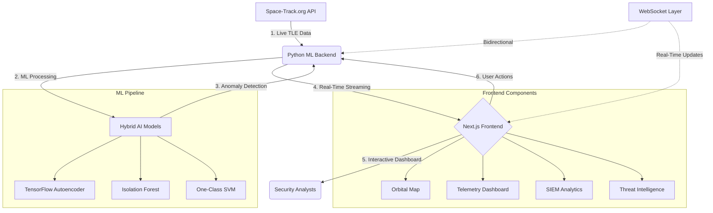

# SENTINEL-X: Advanced Satellite Anomaly Detection & Cybersecurity Platform

**SENTINEL-X** is a comprehensive, enterprise-grade satellite anomaly detection and cybersecurity platform designed for real-time monitoring, threat detection, and space situational awareness. Built with cutting-edge machine learning algorithms and professional cybersecurity interfaces, it provides mission-critical intelligence for satellite operations and space defense.


---

## 📋 Table of Contents

- [🚀 Overview](#-overview)
- [✨ Complete Feature Set](#-complete-feature-set)
- [🏗️ System Architecture](#️-system-architecture)
- [⚙️ Configuration & Setup](#️-configuration--setup)
- [🤖 Machine Learning Pipeline](#-machine-learning-pipeline)
- [� ️ Installation & Setup](#️-installation--setup)
- [� Techn ology Stack](#-technology-stack)
- [� Usageg Guide](#-usage-guide)
- [� TConfiguration](#-configuration)
- [🚨 Troubleshooting](#-troubleshooting)

---

## 🚀 Overview

SENTINEL-X represents the next generation of satellite monitoring and space cybersecurity platforms. Combining real-time data processing, advanced machine learning, and professional-grade visualization, it delivers comprehensive situational awareness for satellite operations, threat detection, and space defense missions.

### Key Capabilities
- **Real-Time Anomaly Detection** using hybrid ML models
- **Professional Cybersecurity Interface** with dark theme optimization
- **Live Satellite Tracking** with orbital visualization
- **MITRE ATT&CK Framework Integration** for threat intelligence
- **Comprehensive Telemetry Analysis** with predictive insights
- **Multi-Modal Alert System** with severity classification
- **Instant Real-Time Integration** with in-app credential management (no .env files needed)

---

## ✨ Complete Feature Set

### 🎯 Core Monitoring & Detection Features

#### **Real-Time Dashboard**
- **Live Data Streaming**: WebSocket-based real-time updates with zero page refresh
- **Professional Dark Theme**: Cybersecurity-optimized color scheme with proper contrast
- **Responsive Grid Layout**: 12x12 grid system for optimal component arrangement
- **Multi-Panel Interface**: Simultaneous monitoring of multiple data streams
- **Status Indicators**: Real-time health scores, alert counts, and system metrics

#### **Interactive Orbital Map**
- **3D Satellite Visualization**: Real-time satellite positions with orbital trajectories
- **Anomaly Highlighting**: Visual indicators for detected anomalies with severity color coding
- **Geographic Overlays**: Earth surface mapping with coordinate systems
- **Zoom & Pan Controls**: Interactive navigation with satellite tracking
- **Click-to-Inspect**: Detailed satellite information on selection

#### **Advanced Telemetry Dashboard**
- **Multi-Tab Interface**: Organized views for Overview, Power Systems, and Sensors & Control
- **Real-Time Gauges**: Live telemetry readings with threshold indicators
- **Timeline Charts**: Historical data visualization with trend analysis
- **System Insights**: Automated analysis and recommendations
- **Performance Metrics**: Battery health, power consumption, and efficiency ratings

### 🔍 Machine Learning & Analytics

#### **Hybrid Anomaly Detection System**
- **TensorFlow Autoencoder**: Deep learning model for pattern recognition and deviation detection
- **Isolation Forest**: Ensemble method for outlier identification
- **One-Class SVM**: Support vector machine for novelty detection
- **Ensemble Voting**: Combined model predictions for enhanced accuracy
- **Real-Time Inference**: Sub-second anomaly detection and classification

#### **Predictive Analytics**
- **Trajectory Prediction**: Future orbital path calculation and visualization
- **System Health Forecasting**: Predictive maintenance recommendations
- **Anomaly Trend Analysis**: Historical pattern recognition and trend prediction
- **Risk Assessment**: Automated threat scoring and severity classification

### 🛡️ Cybersecurity & Threat Intelligence

#### **MITRE ATT&CK Integration**
- **SPARTA Framework Mapping**: Alignment with space-specific threat tactics
- **TTP Coverage Analysis**: Technique, Tactic, and Procedure monitoring
- **Threat Intelligence Dashboard**: Real-time threat landscape visualization
- **Attack Vector Identification**: Automated threat classification and mapping

#### **Security Information & Event Management (SIEM)**
- **Real-Time Log Analysis**: Comprehensive event logging and correlation
- **Incident Response Panel**: Automated alert generation and escalation
- **Forensic Timeline**: Detailed event reconstruction and analysis
- **Compliance Reporting**: Automated security compliance documentation

### 📊 Data Visualization & Reporting

#### **Advanced Charting System**
- **Anomaly Trend Charts**: Time-series visualization of detected anomalies
- **Severity Distribution**: Statistical analysis of threat levels
- **Geographic Heatmaps**: Spatial distribution of anomalies and threats
- **Performance Dashboards**: System health and operational metrics

#### **Comprehensive Reporting**
- **RSO Characterization**: Detailed Resident Space Object analysis
- **Telemetry Reports**: Comprehensive satellite health assessments
- **Threat Intelligence Briefings**: Automated security status reports
- **Operational Summaries**: Mission-critical status updates

### 🔧 System Management & Configuration

#### **Settings & Configuration**
- **User Preferences**: Customizable dashboard layouts and themes
- **Alert Thresholds**: Configurable anomaly detection sensitivity
- **Data Source Management**: Space-Track.org API integration settings
- **System Monitoring**: Backend service health and performance metrics

#### **Manual Alert System**
- **Custom Alert Creation**: User-defined anomaly flagging
- **Severity Classification**: Manual threat level assignment
- **Alert Broadcasting**: Real-time notification distribution
- **Historical Alert Management**: Complete alert lifecycle tracking

### 🌐 Integration & Connectivity

#### **Space-Track.org Integration**
- **Live TLE Data Feeds**: Real-time Two-Line Element data ingestion
- **Satellite Catalog Access**: Comprehensive space object database
- **Automated Data Refresh**: Scheduled data updates every 60 seconds
- **API Rate Limiting**: Intelligent request management and optimization

#### **Real-Time Communication**
- **WebSocket Architecture**: Bidirectional real-time data streaming
- **Event Broadcasting**: Multi-client data synchronization
- **Connection Management**: Automatic reconnection and error handling
- **Data Compression**: Optimized payload delivery for performance

### 🎨 User Interface & Experience

#### **Professional Cybersecurity Theme**
- **Dark Mode Optimization**: Eye-strain reduction for extended monitoring
- **Color-Coded Severity**: Intuitive threat level visualization
- **Responsive Design**: Multi-device compatibility and scaling
- **Accessibility Compliance**: WCAG 2.1 AA standard adherence

#### **Interactive Components**
- **Drag & Drop Interfaces**: Customizable dashboard layouts
- **Context Menus**: Right-click functionality for advanced options
- **Keyboard Shortcuts**: Power-user navigation and control
- **Touch Optimization**: Mobile and tablet interface support

---

## 🏗️ System Architecture

SENTINEL-X is built on a modern, scalable three-tier architecture optimized for real-time data processing, machine learning inference, and professional-grade visualization.



### Architecture Components

#### **1. Data Ingestion Layer**
- **Space-Track.org API Integration**: Official satellite data source with authenticated access
- **Real-Time TLE Processing**: Two-Line Element data parsing and normalization
- **Data Validation**: Comprehensive input validation and error handling
- **Rate Limiting**: Intelligent API request management to prevent throttling

#### **2. Machine Learning Backend**
- **Flask-SocketIO Server**: High-performance Python backend with WebSocket support
- **Multi-Threading**: Concurrent data processing and model inference
- **Model Management**: Dynamic model loading, training, and inference pipeline
- **Data Preprocessing**: Feature extraction and normalization for ML models

#### **3. Real-Time Communication Layer**
- **WebSocket Protocol**: Bidirectional real-time data streaming
- **Event Broadcasting**: Multi-client synchronization and updates
- **Connection Pooling**: Efficient client connection management
- **Data Serialization**: Optimized JSON payload compression

#### **4. Frontend Presentation Layer**
- **Next.js Framework**: Server-side rendering with client-side hydration
- **React Components**: Modular, reusable UI components
- **State Management**: Efficient data flow and component synchronization
- **Responsive Design**: Multi-device compatibility and optimization

---

## ⚙️ Configuration & Setup

### **Space-Track.org Integration**

SENTINEL-X includes built-in support for Space-Track.org API integration to access real-time satellite data. You can configure your credentials directly through the application interface.

#### **In-App Credential Configuration**

1. **Access Settings Panel**
   - Click the settings icon (⚙️) in the top-right corner of the dashboard
   - The settings modal will open with credential input fields

2. **Enter Your Credentials**
   - **Username**: Your Space-Track.org username
   - **Password**: Your Space-Track.org password
   - Click "Save Changes" to store credentials securely

3. **Credential Storage**
   - **Frontend**: Credentials stored in browser localStorage (for future integration)
   - **Backend**: Currently reads from environment variables for real data fetching
   - **Note**: For real-time data, you currently need to set environment variables

#### **Data Sources & Modes**

**Real Data Mode** (With Space-Track Credentials):
- **Live TLE Data**: Real Two-Line Element data from Space-Track.org
- **Actual Satellite Positions**: ISS, Hubble, GPS constellation, etc.
- **Real Orbital Parameters**: Authentic apogee, perigee, inclination data
- **Rate Limited**: Respects Space-Track.org API limits (200 requests/hour)

**Simulation Mode** (Default - No Credentials Required):
- **Mock Satellite Data**: 5 predefined satellites with realistic parameters
- **Simulated Movement**: Satellites move across the map in real-time
- **Randomized Telemetry**: Power, temperature, communication data varies
- **ML Anomaly Generation**: Python backend generates realistic anomalies
- **Full Feature Access**: All dashboard features work identically

**🚀 Real-Time Data Integration (Fully Implemented)**:

1. **User Input**: Click settings icon (⚙️) → Enter Space-Track credentials → Click "Save Changes"
2. **Instant Validation**: Backend immediately validates credentials with Space-Track.org
3. **Real-Time Activation**: Upon successful validation, real satellite data starts flowing immediately
4. **Live Data Fetching**: Background thread fetches real satellite positions every 60 seconds
5. **ML Model Training**: Models automatically retrain on real satellite telemetry data
6. **Real-Time Anomaly Detection**: ML models analyze actual satellite data and generate alerts
7. **Live Dashboard Updates**: All components instantly show real satellite positions and anomalies

**✅ Seamless User Experience**:
- **No Environment Variables Needed**: Everything works through the UI
- **Instant Feedback**: Real-time validation with success/error messages
- **Immediate Data Flow**: Real satellite data appears within seconds of credential entry
- **Automatic Fallback**: Uses simulated data if no credentials provided
- **Persistent Storage**: Credentials saved and automatically used on app restart

**🔄 Data Flow Process**:
```
User enters credentials → Frontend validates → Backend receives → Space-Track API call → 
Real satellite data → ML processing → Live dashboard updates → Continuous 60s refresh cycle
```

#### **Space-Track.org Account Setup**
1. Visit [Space-Track.org](https://www.space-track.org/auth/createAccount)
2. Complete the free registration process
3. Verify your email address
4. Use your credentials in the SENTINEL-X settings panel

**Note**: Space-Track.org credentials are optional. The application works fully with simulated data for demonstration and development purposes.

### **Complete Frontend Features Actually Implemented**

#### **🎛️ Main Dashboard Layout (12x12 Grid)**

1. **Header Metrics Bar** (Full Width)
   - **Active Alerts**: Real-time count of detected anomalies
   - **Tracked RSOs**: Number of satellites currently monitored
   - **MITRE TTPs**: Percentage of threat techniques covered
   - **Overall Threat Score**: Aggregated risk assessment (0-100)
   - **Settings Icon**: Click to configure Space-Track credentials

2. **Live Orbital Map** (8x8 Grid Span)
   - **Interactive Leaflet Map**: Dark theme world map
   - **Real-Time Satellite Markers**: Color-coded by anomaly severity
     - 🟢 Green: Normal operation
     - 🟡 Yellow: Medium severity anomalies
     - 🔴 Red: High severity anomalies
     - 🔵 Cyan border: Flagged anomalies
   - **Clickable Markers**: Popup with satellite details and "Flag" button
   - **Live Position Updates**: Markers move in real-time
   - **Anomaly Highlighting**: Visual indicators for detected issues

3. **RSO Characterization Panel** (4x4 Grid Span)
   - **Satellite Dropdown**: Select from tracked satellites
   - **Threat Score Display**: Large numerical threat assessment
   - **Country & Type Info**: Origin country and satellite classification
   - **Multi-Tab Interface**:
     - **Overview Tab**: Orbital parameters (period, inclination, apogee, perigee)
     - **Telemetry Tab**: Live system status, telemetry dashboard, last contact
     - **Mitigation Tab**: MITRE/SPARTA defense capabilities
     - **Details Tab**: Trajectory prediction, mission objectives, operational history

4. **Telemetry Subframes** (4x4 Grid Span)
   - **Search Functionality**: Filter subframes by name
   - **Type Filtering**: Dropdown to filter by subframe type
   - **Subframe List**: Scrollable list with timestamps and descriptions
   - **Real-Time Updates**: New subframes appear automatically

5. **Manual Alert Panel** (4x4 Grid Span)
   - **Satellite Name Input**: Text field for target satellite
   - **Anomaly Type Input**: Text field for anomaly description
   - **Severity Selector**: Dropdown (Low, Medium, High)
   - **Create Alert Button**: Submit manual anomaly reports
   - **Form Validation**: Ensures all fields are filled

6. **System Event Log** (8x4 Grid Span)
   - **Chronological Event List**: Most recent events first
   - **Color-Coded Severity**:
     - 🔵 Blue: INFO level events
     - 🟡 Yellow: WARNING level events
     - 🔴 Red: ERROR level events
   - **Timestamp Display**: Precise time for each event
   - **Auto-Scroll**: New events automatically appear
   - **Monospace Font**: Terminal-style display

7. **SPARTA/MITRE Alignment Panel** (4x4 Grid Span)
   - **TTP Coverage Bars**: Visual progress bars for each technique
   - **Percentage Display**: Numerical coverage percentages
   - **Threat Intelligence**: Real-time threat landscape assessment
   - **Color-Coded Progress**: Blue progress bars for coverage levels

#### **🔧 Advanced Components (Referenced in RSO Panel)**

8. **Telemetry Dashboard** (Within RSO Characterization)
   - **Real-Time Gauges**: Circular progress indicators
   - **8-Parameter Monitoring**: Power, temperature, communication, etc.
   - **Threshold Indicators**: Red/yellow/green status colors
   - **Live Data Streaming**: Updates every 15 seconds

9. **Trajectory Prediction** (Within RSO Details Tab)
   - **Future Orbital Path**: Calculated trajectory predictions
   - **Velocity & Altitude**: Current orbital parameters
   - **Prediction Timeline**: Future position calculations
   - **Refresh Interval**: Updates every 60 seconds

10. **MITRE/SPARTA Defense Panel** (Within RSO Mitigation Tab)
    - **Defensive Capabilities**: Maneuverability, comms jamming resistance
    - **Sensor Blinding Protection**: Anti-optical attack measures
    - **Capability Assessment**: Boolean indicators for each defense

#### **🎨 UI/UX Features Actually Implemented**

11. **Professional Dark Theme**
    - **Cyber Security Aesthetic**: Dark backgrounds with neon accents
    - **Color-Coded Status**: Consistent color scheme throughout
    - **High Contrast**: Optimized for security operations centers
    - **Rounded Corners**: Modern card-based layout

12. **Interactive Elements**
    - **Hover Effects**: Scale transforms on header metrics
    - **Clickable Components**: Satellite markers, buttons, dropdowns
    - **Form Validation**: Real-time input validation
    - **Responsive Design**: Adapts to different screen sizes

13. **Real-Time Data Flow**
    - **WebSocket Connection**: Live data streaming from Python backend
    - **Auto-Updates**: All components refresh automatically
    - **Connection Status**: Visual indicators for live data
    - **Error Handling**: Graceful fallbacks for connection issues

#### **📊 Data Visualization Features**

14. **Charts & Graphs** (Available Components)
    - **Anomaly Trend Charts**: Time-series anomaly visualization
    - **Severity Distribution**: Statistical analysis charts
    - **Geographic Heatmaps**: Spatial anomaly distribution
    - **Satellite Status Charts**: Health status visualizations
    - **Telemetry Timeline**: Historical parameter trends

15. **Additional Available Components** (Not Currently in Main Layout)
    - **Cesium Globe**: 3D Earth visualization
    - **SIEM Analytics Dashboard**: Security event analysis
    - **Incident Response Panel**: Automated response workflows
    - **ML Prediction Alerts**: Machine learning confidence displays
    - **Real-Time Metrics**: Performance monitoring gauges

---

## 🛠️ Quick Installation & Setup

### **Prerequisites**
- **Node.js** 18+ and npm
- **Python** 3.8+ with pip
- **Git** for version control

### **Installation Steps**

1. **Clone the Repository**
   ```bash
   git clone <repository-url>
   cd SENTINEL-X-feat-python-ml-service
   ```

2. **Install Dependencies**
   ```bash
   # Install Python dependencies
   pip install -r requirements.txt
   
   # Install Node.js dependencies
   npm install
   ```

3. **Start the Application**
   ```bash
   # Option 1: Automated startup (Recommended)
   npm run start-all
   # or
   python scripts/start-sentinel-x.py
   
   # Option 2: Manual startup
   # Terminal 1: Start ML service
   python services/ml_service/main.py
   
   # Terminal 2: Start frontend
   npm run dev
   ```

4. **Access the Dashboard**
   - **Frontend Dashboard**: http://localhost:3000
   - **ML Service API**: http://localhost:5000
   - **WebSocket Connection**: Automatic via frontend

5. **Configure Space-Track Credentials (Optional - For Real Satellite Data)**
   
   **🎯 Recommended Method (Fully Integrated):**
   1. Open the application at http://localhost:3000
   2. Click the settings icon (⚙️) in the top-right corner
   3. Enter your Space-Track.org username and password
   4. Click "Save Changes"
   5. ✅ Real-time satellite data will start flowing immediately!
   
   **Alternative Method (Environment Variables):**
   ```bash
   # Set before starting the application
   # Windows
   set SPACE_TRACK_USERNAME=your_username
   set SPACE_TRACK_PASSWORD=your_password
   
   # macOS/Linux
   export SPACE_TRACK_USERNAME="your_username"
   export SPACE_TRACK_PASSWORD="your_password"
   ```

### **Verification**
```bash
# Run verification script
npm run verify
# or
python scripts/verify-installation.py

# Test ML service
curl http://localhost:5000/health

# Test frontend
curl http://localhost:3000
```

---

## 🤖 Machine Learning Pipeline

SENTINEL-X employs a sophisticated hybrid machine learning approach designed for maximum accuracy and minimal false positives in satellite anomaly detection.

### **Data Processing Pipeline**

#### **Feature Engineering**
- **Telemetry Extraction**: Power, temperature, communication, voltage, solar efficiency
- **Orbital Parameters**: Altitude, velocity, inclination, orbital period
- **Temporal Features**: Time-series analysis and trend detection
- **Derived Metrics**: Calculated health scores and performance indicators

#### **Data Normalization**
- **Statistical Normalization**: Z-score standardization for consistent model input
- **Outlier Handling**: Robust scaling techniques for extreme value management
- **Missing Data Imputation**: Advanced interpolation for incomplete datasets
- **Feature Scaling**: Min-max scaling for neural network optimization

### **Hybrid Model Architecture**

#### **1. TensorFlow Autoencoder**
- **Architecture**: 8-4-8 encoder-decoder neural network
- **Training**: Unsupervised learning on normal operational patterns
- **Detection Method**: Reconstruction error threshold analysis
- **Strengths**: Excellent at detecting subtle pattern deviations
- **Use Case**: Gradual system degradation and performance drift

#### **2. Isolation Forest**
- **Algorithm**: Ensemble of isolation trees for outlier detection
- **Parameters**: 100 estimators with automatic contamination detection
- **Detection Method**: Path length analysis for anomaly scoring
- **Strengths**: Robust statistical outlier identification
- **Use Case**: Sudden system failures and extreme value detection

#### **3. One-Class SVM**
- **Kernel**: Radial Basis Function (RBF) for non-linear decision boundaries
- **Parameters**: Nu=0.1, Gamma=0.1 for optimal sensitivity
- **Detection Method**: Support vector boundary analysis
- **Strengths**: Excellent novelty detection capabilities
- **Use Case**: Unknown attack patterns and zero-day threats

### **Ensemble Decision Making**
- **Voting System**: Weighted combination of all three model predictions
- **Confidence Scoring**: Probabilistic anomaly assessment
- **Threshold Optimization**: Dynamic threshold adjustment based on historical performance
- **False Positive Reduction**: Multi-model consensus for improved accuracy

### **Model Training & Adaptation**
- **Initial Training**: Bootstrap training on first 60 seconds of live data
- **Continuous Learning**: Periodic model retraining with new data
- **Performance Monitoring**: Real-time model accuracy and drift detection
- **Automated Retraining**: Scheduled model updates for optimal performance

---

## 🛠️ Installation & Setup

Follow this comprehensive guide to deploy SENTINEL-X on your system. These instructions are designed to ensure a flawless installation with zero errors.

### 📋 System Requirements

#### **Minimum Requirements**
- **Operating System**: Windows 10/11, macOS 10.15+, or Ubuntu 18.04+
- **RAM**: 8GB minimum, 16GB recommended
- **Storage**: 5GB free space
- **Network**: Stable internet connection for Space-Track.org API access

#### **Software Prerequisites**
- **Node.js**: Version 18.0.0 or later ([Download](https://nodejs.org/))
- **Python**: Version 3.9.0 or later ([Download](https://www.python.org/))
- **Git**: Latest version ([Download](https://git-scm.com/))
- **Space-Track.org Account**: Free registration required ([Register](https://www.space-track.org/auth/createAccount))

### 🚀 Step-by-Step Installation

#### **Step 1: Environment Preparation**

1. **Verify Node.js Installation**
   ```bash
   node --version
   npm --version
   ```
   Expected output: Node.js v18+ and npm v8+

2. **Verify Python Installation**
   ```bash
   python --version
   # or on some systems:
   python3 --version
   ```
   Expected output: Python 3.9+

3. **Create Space-Track.org Account (Optional)**
   - Visit [Space-Track.org](https://www.space-track.org/auth/createAccount)
   - Complete registration and email verification
   - You can enter credentials later through the app's settings panel

#### **Step 2: Repository Setup**

1. **Clone the Repository**
   ```bash
   git clone https://github.com/your-username/sentinel-x.git
   cd sentinel-x
   ```

2. **Verify Repository Structure**
   ```bash
   ls -la
   ```
   You should see: `app/`, `components/`, `services/`, `package.json`, `requirements.txt`

#### **Step 3: Install Dependencies**

1. **Install Python Dependencies**
   ```bash
   pip install -r requirements.txt
   ```
   
2. **Install Node.js Dependencies**
   ```bash
   npm install
   ```

#### **Step 4: Verify Installation**

1. **Check Dependencies**
   ```bash
   npm list --depth=0
   ```
   This should show all installed packages without errors.

2. **Clear npm Cache (if needed)**
   ```bash
   npm cache clean --force
   ```

#### **Step 5: Backend Dependencies Installation**

1. **Create Python Virtual Environment (Recommended)**
   ```bash
   # Windows
   python -m venv venv
   venv\Scripts\activate
   
   # macOS/Linux
   python3 -m venv venv
   source venv/bin/activate
   ```

2. **Upgrade pip**
   ```bash
   python -m pip install --upgrade pip
   ```

3. **Install Python Dependencies**
   ```bash
   pip install -r requirements.txt
   ```

4. **Verify Python Installation**
   ```bash
   pip list
   ```
   Ensure TensorFlow, Flask-SocketIO, and scikit-learn are installed.

#### **Step 5: System Verification**

1. **Run Verification Script**
   ```bash
   npm run verify
   # or
   python scripts/verify-installation.py
   ```

### 🚀 Running the Application

#### **Method 1: Manual Startup (Recommended for Development)**

1. **Terminal 1 - Start Backend Service**
   ```bash
   python services/ml_service/main.py
   ```
   
   **Expected Output:**
   ```
   INFO:root:Flask app created.
   INFO:root:SocketIO initialized.
   INFO:root:Thread lock initialized.
   INFO:root:Creating Autoencoder model...
   INFO:root:Starting server...
   * Running on all addresses (0.0.0.0)
   * Running on http://127.0.0.1:5000
   * Running on http://[your-ip]:5000
   ```

2. **Terminal 2 - Start Frontend Service**
   ```bash
   npm run dev
   ```
   
   **Expected Output:**
   ```
   ▲ Next.js 14.2.25
   - Local:        http://localhost:3000
   - Network:      http://[your-ip]:3000
   
   ✓ Ready in 2.3s
   ```

#### **Method 2: Production Deployment**

1. **Build Frontend for Production**
   ```bash
   npm run build
   npm start
   ```

2. **Run Backend in Production Mode**
   ```bash
   python services/ml_service/main.py
   ```

### 🌐 Accessing the Application

1. **Open your web browser**
2. **Navigate to**: `http://localhost:3000`
3. **Wait for initial data load** (30-60 seconds for first satellite data fetch)
4. **Verify functionality**:
   - Dashboard displays real-time metrics
   - Orbital map shows satellite positions
   - Telemetry data updates automatically
   - No console errors in browser developer tools

### 🔧 Post-Installation Configuration

#### **Firewall Configuration**
- **Windows**: Allow Node.js and Python through Windows Firewall
- **macOS**: Grant network access permissions when prompted
- **Linux**: Configure iptables if necessary

#### **Performance Optimization**
1. **Increase Node.js Memory Limit** (for large datasets):
   ```bash
   export NODE_OPTIONS="--max-old-space-size=4096"
   ```

2. **Python Memory Optimization**:
   ```bash
   export PYTHONHASHSEED=0
   export TF_CPP_MIN_LOG_LEVEL=2
   ```

#### **Development Tools Setup**
1. **Install VS Code Extensions** (Optional):
   - Python
   - TypeScript and JavaScript Language Features
   - Tailwind CSS IntelliSense

2. **Configure Git Hooks** (Optional):
   ```bash
   npm install --save-dev husky
   npx husky install
   ```

---

## 💻 Technology Stack

### **Backend Infrastructure**

#### **Core Framework**
- **Python 3.9+**: High-performance backend runtime
- **Flask-SocketIO**: Real-time WebSocket communication framework
- **Threading**: Concurrent processing for ML inference and data streaming
- **Requests**: HTTP client for Space-Track.org API integration

#### **Machine Learning Stack**
- **TensorFlow 2.x**: Deep learning framework for autoencoder models
- **Keras**: High-level neural network API
- **Scikit-learn**: Machine learning library for ensemble methods
- **NumPy**: Numerical computing and array operations
- **Pandas**: Data manipulation and analysis (optional)

#### **Data Processing**
- **JSON**: Lightweight data interchange format
- **WebSocket Protocol**: Real-time bidirectional communication
- **REST API**: Space-Track.org data integration
- **Threading Locks**: Thread-safe data access and manipulation

### **Frontend Architecture**

#### **Core Framework**
- **Next.js 14**: React framework with server-side rendering
- **React 18**: Component-based UI library with hooks
- **TypeScript**: Type-safe JavaScript development
- **Node.js 18+**: JavaScript runtime environment

#### **UI Components & Styling**
- **Radix UI**: Accessible, unstyled UI primitives
- **Tailwind CSS 4**: Utility-first CSS framework
- **Lucide React**: Beautiful, customizable SVG icons
- **Class Variance Authority**: Component variant management
- **Tailwind Merge**: Intelligent Tailwind class merging

#### **Data Visualization**
- **Recharts**: Composable charting library for React
- **Leaflet.js**: Interactive maps for satellite visualization
- **React Leaflet**: React components for Leaflet maps
- **D3.js Integration**: Advanced data visualization capabilities

#### **Real-Time Communication**
- **Socket.IO Client**: WebSocket client for real-time updates
- **React Hooks**: State management for real-time data
- **Event Handling**: User interaction and system events

### **Development & Build Tools**

#### **Frontend Tooling**
- **ESLint**: Code linting and quality assurance
- **PostCSS**: CSS processing and optimization
- **Autoprefixer**: Automatic CSS vendor prefixing
- **TypeScript Compiler**: Type checking and compilation

#### **Backend Tooling**
- **pip**: Python package management
- **Virtual Environment**: Isolated Python dependencies
- **Flask Development Server**: Hot reloading for development
- **Python Logging**: Comprehensive application logging

### **External Integrations**

#### **Data Sources**
- **Space-Track.org API**: Official satellite tracking data
- **TLE (Two-Line Element) Format**: Standardized orbital data
- **NORAD Catalog**: Satellite identification system
- **Real-Time Data Feeds**: Live satellite telemetry

#### **Security & Compliance**
- **HTTPS/WSS**: Encrypted communication protocols
- **Environment Variables**: Secure credential management
- **CORS Configuration**: Cross-origin resource sharing
- **Input Validation**: Data sanitization and validation

### **Deployment & Infrastructure**

#### **Development Environment**
- **Local Development**: Hot reloading and debugging
- **Environment Variables**: Configuration management
- **Multi-Process Architecture**: Separate frontend/backend processes
- **Port Configuration**: Customizable service ports

#### **Production Considerations**
- **Process Management**: PM2 or systemd integration
- **Reverse Proxy**: Nginx or Apache configuration
- **SSL/TLS Certificates**: HTTPS encryption
- **Load Balancing**: Horizontal scaling capabilities
- **Database Integration**: Optional persistent storage
- **Monitoring & Logging**: Application performance monitoring

### **Performance Optimizations**

#### **Frontend Performance**
- **Code Splitting**: Dynamic imports and lazy loading
- **Image Optimization**: Next.js automatic image optimization
- **Caching Strategies**: Browser and CDN caching
- **Bundle Analysis**: Webpack bundle optimization

#### **Backend Performance**
- **Async Processing**: Non-blocking I/O operations
- **Connection Pooling**: Efficient WebSocket management
- **Memory Management**: Optimized data structures
- **CPU Optimization**: Multi-threading for ML inference

---

## 📊 Usage Guide

### **Initial Setup & First Run**

1. **System Startup**: Follow installation instructions above
2. **Data Initialization**: Wait 60 seconds for initial satellite data fetch
3. **Dashboard Overview**: Familiarize yourself with the main interface
4. **Feature Exploration**: Navigate through different dashboard sections

### **Dashboard Navigation**

#### **Main Dashboard Components**
- **Header Bar**: System metrics, alerts, and settings access
- **Orbital Map**: Interactive satellite visualization (left panel)
- **RSO Characterization**: Satellite details and threat assessment (top right)
- **Subframes**: System status and telemetry data (middle right)
- **Manual Alerts**: User-defined anomaly flagging (bottom right)
- **Event Log**: Real-time system events and anomalies (bottom left)
- **SPARTA/MITRE Alignment**: Threat intelligence mapping (bottom right)

#### **Interactive Features**
- **Satellite Selection**: Click on satellites in the orbital map for details
- **Anomaly Flagging**: Right-click on anomalies to flag or investigate
- **Manual Alerts**: Create custom alerts using the manual alert panel
- **Data Filtering**: Use dashboard controls to filter by time, severity, or type
- **Export Functions**: Download reports and data for external analysis

### **Monitoring Workflows**

#### **Real-Time Monitoring**
1. Monitor the main dashboard for real-time updates
2. Watch for color-coded severity indicators
3. Review incoming alerts in the event log
4. Investigate anomalies using the orbital map
5. Create manual alerts for suspicious activity

#### **Threat Analysis**
1. Review SPARTA/MITRE TTP alignments for threat context
2. Analyze anomaly trends using the telemetry dashboard
3. Correlate events across multiple satellites
4. Generate threat intelligence reports
5. Coordinate response actions with security teams

---

## 🔧 Configuration

### **Environment Variables**

```bash
# Required Configuration
SPACE_TRACK_USERNAME=your_username
SPACE_TRACK_PASSWORD=your_password

# Optional Configuration
NODE_ENV=development
PORT=3000
BACKEND_PORT=5000
LOG_LEVEL=INFO
REFRESH_INTERVAL=60000
```

### **Advanced Configuration**

#### **ML Model Parameters**
- Modify `services/ml_service/main.py` for model tuning
- Adjust anomaly detection thresholds
- Configure ensemble voting weights
- Set retraining intervals

#### **Frontend Customization**
- Update `app/globals.css` for theme modifications
- Modify component layouts in `app/page.tsx`
- Configure dashboard refresh rates
- Customize alert severity levels

---

## 🚨 Troubleshooting

### **Common Issues & Solutions**

#### **Backend Connection Issues**
```bash
# Check if backend is running
curl http://localhost:5000

# Verify Space-Track credentials
python -c "import os; print(os.getenv('SPACE_TRACK_USERNAME'))"

# Check Python dependencies
pip list | grep -E "(flask|tensorflow|sklearn)"
```

#### **Frontend Build Issues**
```bash
# Clear npm cache
npm cache clean --force

# Reinstall dependencies
rm -rf node_modules package-lock.json
npm install

# Check Node.js version
node --version
```

#### **Data Loading Issues**
- Verify internet connection
- Check Space-Track.org service status
- Confirm API credentials are correct
- Review backend logs for error messages

#### **Performance Issues**
- Increase system memory allocation
- Close unnecessary applications
- Check network bandwidth
- Monitor CPU usage during ML inference

### **Debug Mode**
```bash
# Enable debug logging
export LOG_LEVEL=DEBUG

# Run with verbose output
python services/ml_service/main.py --verbose

# Frontend debug mode
npm run dev -- --debug
```

### **Support & Documentation**
- Check GitHub Issues for known problems
- Review application logs for error details
- Consult Space-Track.org API documentation
- Contact development team for technical support
